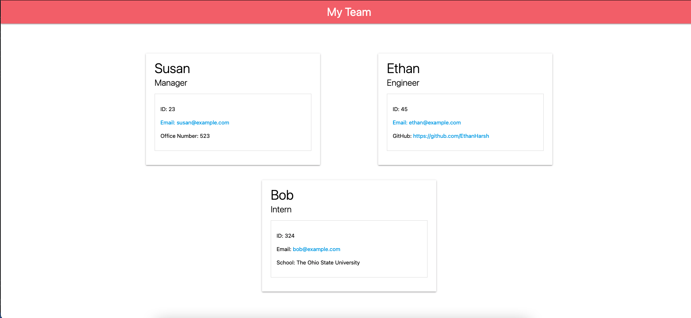

# 10-Object-Oriented-Programming-Team-Profile-Generator
   

## Application Demo
[YouTube](https://www.youtube.com/watch?v=NW3TcTw3fJw)

## Description
Keep track of your team with a great team page!

## Project Goals:
- Write and Pass Jest Tests
- Ask questions with Inquirer
- Write Team Page HTML Document

## Skills Learned
- [Inquirer](https://www.npmjs.com/package//inquirer)
- [Node.js](https://developer.mozilla.org/en-US/docs/Glossary/Node.js?utm_campaign=feed&utm_medium=rss&utm_source=developer.mozilla.org)
- [Jest](https://www.npmjs.com/package/jest)
## Resources
- [Node.js Documentation](https://nodejs.org/en/docs/)
- [Inquirer](https://www.npmjs.com/package//inquirer)
- [Jest](https://www.npmjs.com/package/jest)
- [MaterializeCSS](https://materializecss.com/)
- **General Reference ->** [MDN](https://developer.mozilla.org/en-US/)
- **Design Reference ->** [MDN](https://material.io/)